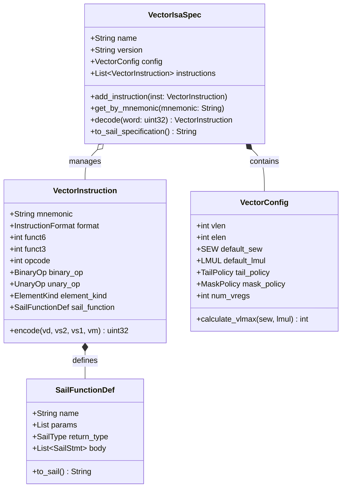

# Domain Model Specification

This document formally specifies the Domain Entities, Value Objects, Aggregates, Invariants, and Lifecycle Events in **random_vISA**.

---

## 📐 Domain Entity-Relationship Overview

---

## 🔒 Domain Invariants & Constraints

1. **`VectorConfig` Invariants**:
   - `vlen > 0` and must be a power of 2: $vlen \in \{2^k \mid k \ge 6\}$.
   - `elen <= vlen`.
   - `num_vregs >= 8` and must be a power of 2: $num\_vregs \in \{8, 16, 32, 64, 128\}$.
   - `calculate_vlmax(sew, lmul) = (vlen / sew.value) * lmul.multiplier_val`.

2. **`VectorIsaSpec` Invariants**:
   - **No Encoding Collisions**: No two instructions may share the same triplet `(opcode, funct3, funct6)`.
   - **No Mnemonic Duplicates**: Every instruction in the aggregate must have a unique identifier string.

3. **`VectorInstruction` Invariants**:
   - `0 <= funct6 <= 63` (6-bit field).
   - `0 <= funct3 <= 7` (3-bit field).
   - `opcode == 0x57` (standard RISC-V vector opcode).
   - Encoding packing formula:
     $$\text{word} = (\text{funct6} \ll 26) \mid (\text{vm} \ll 25) \mid (\text{vs2} \ll 20) \mid (\text{vs1\_or\_rs1\_or\_imm} \ll 15) \mid (\text{funct3} \ll 12) \mid (\text{vd} \ll 7) \mid \text{opcode}$$

---

## 📣 Domain Events

- **`InstructionSynthesizedEvent`**: Emitted when a new valid instruction with verified encoding is generated.
- **`IsaSpecCompletedEvent`**: Emitted when an entire Vector ISA specification aggregate finishes synthesis.
- **`CppEmulatorEmittedEvent`**: Emitted when C++ emulator sources are successfully written to destination.
